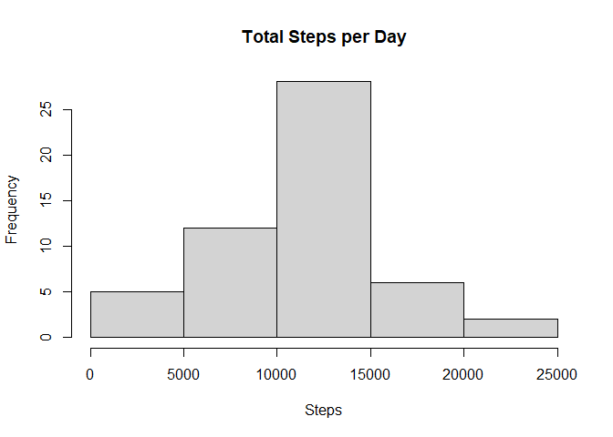
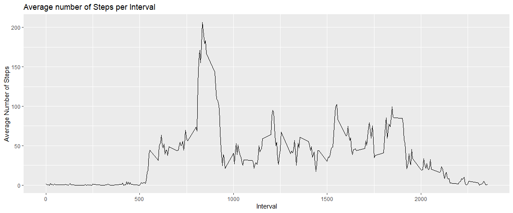
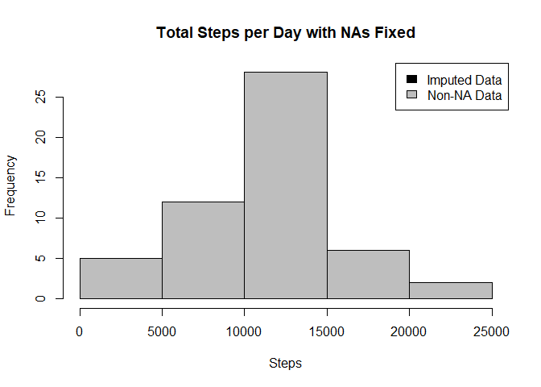

## First step: load data
Loading and preprocessing the data
Show any code that is needed to

* Load the data

* Process/transform the data (if necessary) into a format suitable for your analysis


```r
datos <- read.csv("activity.csv")
head(datos)
```

```
##   steps       date interval
## 1    NA 2012-10-01        0
## 2    NA 2012-10-01        5
## 3    NA 2012-10-01       10
## 4    NA 2012-10-01       15
## 5    NA 2012-10-01       20
## 6    NA 2012-10-01       25
```

```r
str(datos)
```

```
## 'data.frame':	17568 obs. of  3 variables:
##  $ steps   : int  NA NA NA NA NA NA NA NA NA NA ...
##  $ date    : chr  "2012-10-01" "2012-10-01" "2012-10-01" "2012-10-01" ...
##  $ interval: int  0 5 10 15 20 25 30 35 40 45 ...
```

```r
summary(datos)
```

```
##      steps            date              interval     
##  Min.   :  0.00   Length:17568       Min.   :   0.0  
##  1st Qu.:  0.00   Class :character   1st Qu.: 588.8  
##  Median :  0.00   Mode  :character   Median :1177.5  
##  Mean   : 37.38                      Mean   :1177.5  
##  3rd Qu.: 12.00                      3rd Qu.:1766.2  
##  Max.   :806.00                      Max.   :2355.0  
##  NA's   :2304
```

### Procesing data and cleaning


```r
datos$day <- weekdays(as.Date(datos$date))
datos$date <- as.POSIXct(datos$date, format = "%Y-%m-%d")

datos_limpios <- datos[!is.na(datos$steps),]
```


```r
datos$day <- weekdays(as.Date(datos$date))
datos$date <- as.POSIXct(datos$date, format = "%Y-%m-%d")

datos_limpios <- datos[!is.na(datos$steps),]
```


```r
head(datos_limpios)
```

```
##     steps       date interval     day
## 289     0 2012-10-02        0 Tuesday
## 290     0 2012-10-02        5 Tuesday
## 291     0 2012-10-02       10 Tuesday
## 292     0 2012-10-02       15 Tuesday
## 293     0 2012-10-02       20 Tuesday
## 294     0 2012-10-02       25 Tuesday
```

## What is the average daily activity pattern?
#### 1. Calculate the total number of steps taken per day (ignore the missing values)

```r
sumTable <- aggregate(datos$steps ~ datos$date, FUN=sum, )
colnames(sumTable)<- c("Date", "Steps")

#making histogram
hist(sumTable$Steps, breaks=5, xlab="Steps", main = "Total Steps per Day")
```

<!-- -->

Calculate and report the mean and median of the total number of steps taken per day

```r
as.integer(mean(sumTable$Steps))
```

```
## [1] 10766
```

```r
as.integer(median(sumTable$Steps))
```

```
## [1] 10765
```

## What is the average daily activity pattern?
We need two:
1- Make a time series plot
2- Which 5-minute interval, on average across all the days in the dataset, contains the maximum number of steps?


```r
#import libraries
library(plyr)
library(ggplot2)

#creating data
datos_limpios <- datos[!is.na(datos$steps),]

#creating average
Table_inter <- ddply(datos_limpios, .(interval), summarize, Avg=mean(steps))

#creating line plot
p <- ggplot(Table_inter, aes(x=interval, y=Avg), xlab="Interval", ylab = "Average Numbwer of Steps")
p + geom_line() + xlab("Interval") + ylab("Average Number of Steps") + ggtitle("Average number of Steps per Interval")
```

<!-- -->

```r
##Maximum steps by interval
maxSteps <- max(Table_inter$Avg)
##Which interval contains the maximum average number of steps
Table_inter[Table_inter$Avg==maxSteps,1]
```

```
## [1] 835
```
## Imputing missing values
Note that there are a number of days/intervals where there are missing values (coded as \color{red}{\verb|NA|}NA). The presence of missing days may introduce bias into some calculations or summaries of the data.

Calculate and report the total number of missing values in the dataset (i.e. the total number of rows with \color{red}{\verb|NA|}NAs)

Devise a strategy for filling in all of the missing values in the dataset. The strategy does not need to be sophisticated. For example, you could use the mean/median for that day, or the mean for that 5-minute interval, etc.

Create a new dataset that is equal to the original dataset but with the missing data filled in.

Make a histogram of the total number of steps taken each day and Calculate and report the mean and median total number of steps taken per day. Do these values differ from the estimates from the first part of the assignment? What is the impact of imputing missing data on the estimates of the total daily number of steps?

#### 1. Calculate and report the total number of missing values in the dataset (i.e. the total number of rows with NAs)


```r
#Number of NAs in original data set
nrow(datos[is.na(datos$steps),])
```

```
## [1] 2304
```

The total number of rows with steps = 'NA' equal to 2304

#### 2. Devise a strategy for filling in all of the missing values in the dataset


```r
# First, creating average number
Table_avg <- ddply(datos_limpios, .(interval, day), summarize, Avg=mean(steps))

#Second, creating dataset with all NAs for substitution
nadatos <- datos[is.na(datos$steps),]

#merge datas
nuevos_datos <- merge(nadatos, Table_avg, by =c("interval", "day"))
```

#### 3. Create a new dataset that is equal to the original dataset but with the missing data filled in.
Below code is just to verify if process of imputing missing values correctly preserved original values (lines with no NAs)   

```r
#creating datas
nuevos_datos2 <- nuevos_datos[,c(3,4,1,2)]
colnames(nuevos_datos2) <- c("steps", "date", "interval", "day")

#mergin datas
mergeData <- rbind(datos_limpios, nuevos_datos2)
```

Making histogram.... hard work,, jeje

```r
#sum of steps
sumTable2 <- aggregate(mergeData$steps~ mergeData$date, FUN = sum,)
colnames(sumTable2) <- c("Date", "Steps")

#Mean
as.integer(mean(sumTable2$Steps))
```

```
## [1] 10766
```

```r
#median
as.integer(median(sumTable2$Steps))
```

```
## [1] 10765
```

```r
#histogram
hist(sumTable2$Steps, breaks=5, xlab="Steps", main = "Total Steps per Day with NAs Fixed", col="Black")
hist(sumTable$Steps, breaks=5, xlab="Steps", main = "Total Steps per Day with NAs Fixed", col="Grey", add=T)
legend("topright", c("Imputed Data", "Non-NA Data"), fill=c("black", "grey") )
```

<!-- -->

## Are there differences in activity patterns between weekdays and weekends?
## Create new category based on the days of the week


```r
library(lattice) 
mergeData$DayCategory <- ifelse(mergeData$day %in% c("Saturday", "Sunday"), "Weekend", "Weekday")

## Summarize data by interval and type of day
intervalTable2 <- ddply(mergeData, .(interval, DayCategory), summarize, Avg = mean(steps))

##Plot data in a panel plot
xyplot(Avg~interval|DayCategory, data=intervalTable2, type="l",  layout = c(1,2),
       main="Average Steps per Interval Based on Type of Day", 
       ylab="Average Number of Steps", xlab="Interval")
```

<!-- -->


